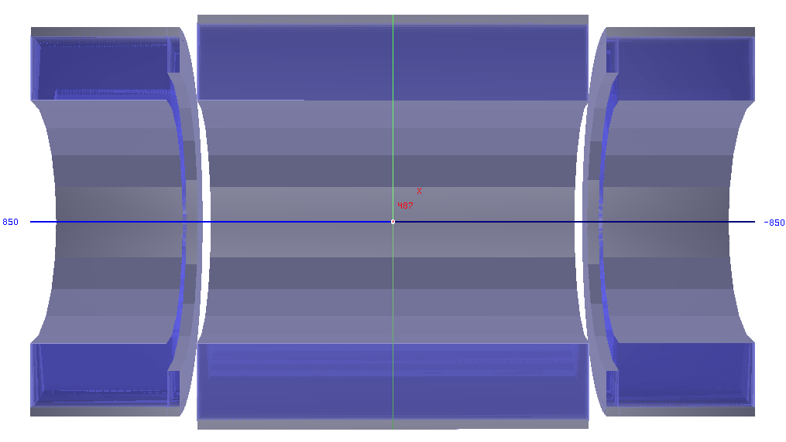
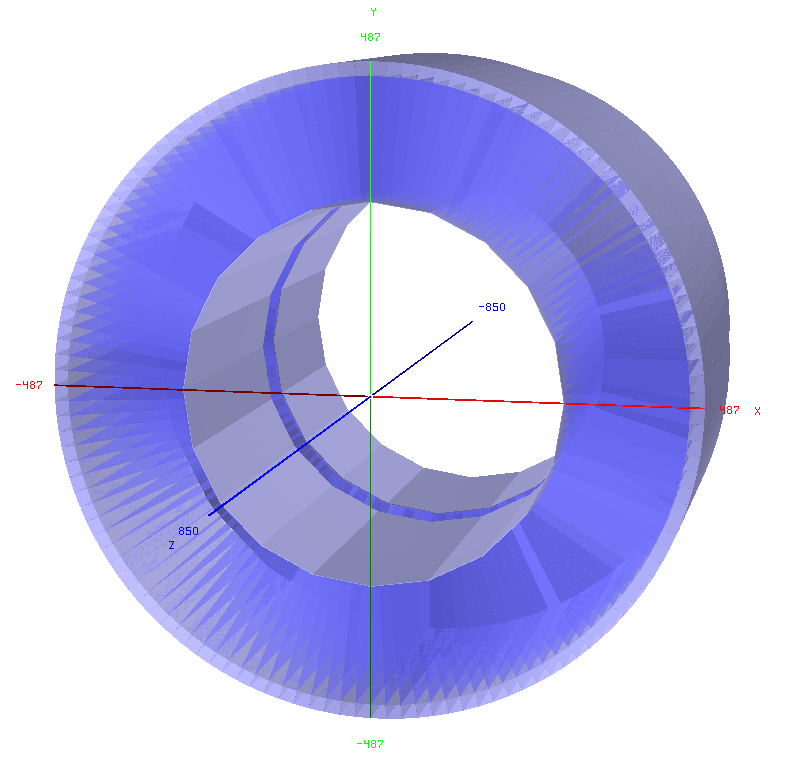

Tile Calorimeter Description
==

### Table of contents:
* [Geometry](#geometry)
* [Parameter description](#parameter-description)

Tile Calorimeter geometry
--

The Hadronic Calorimeter in the Barrel (B) and Extended Barrel (EB) of the reference FCC-hh detector follows the ATLAS HCAL EB and B design. The so-called Tile Calorimeter (TileCal) consists of Scintillator tiles interating with Steel absorber tiles and plates, referred to as spacers (Steel tiles) and masters (Steel plates). The tiles are placed perpendular to the beam pipe, and is thus differently oriented to a classical sampling calorimeter. In the figures below you can see images of the B and EB geometries, where the silver areas are made of steel and outer support structures. The blue areas are filled with modules that have a trapezoidal shape and are again filled by wedges that are filled along the beam line (z axis). Each wedge consists in the Barrel of 10 layers of 2x10cm + 4x15cm + 4x25cm long tiles in radius. Each layer again consists of a sequence of tiles that is defined in FCChh_HCalTileDefinition.xml and iterating with the layers. The number of layers is different in the EB

