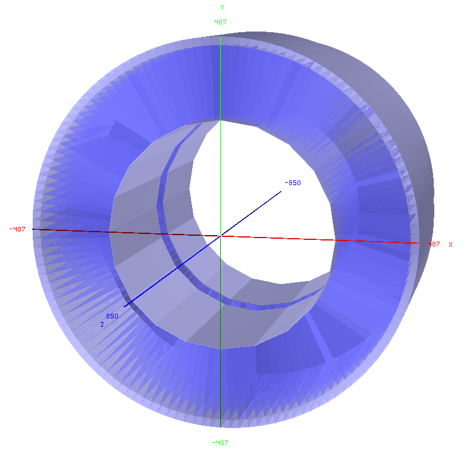

Tile Calorimeter Description
==

### Table of contents:
* [Geometry](#geometry)
* [Parameter description](#parameter-description)

Tile Calorimeter geometry
--

The Tile calorimeter design in FCCSW follows the ATLAS HCAL Barrel and extended Barrel design. The so-called TileCal consists of Scintillator tiles interating with Steel absorber tiles and plates, referred to as spacers (Steel tiles) and masters (Steel plates). The tiles are orientated perpendular to the (x-z plane), thus different to a classical sampling calorimeter. In Figures

Format: 
